<!--
**the-whiz84/the-whiz84** is a ✨ _special_ ✨ repository because its `README.md` (this file) appears on your GitHub profile.

Here are some ideas to get you started:

- 🔭 I’m currently working on ...
- 🌱 I’m currently learning ...
- 👯 I’m looking to collaborate on ...
- 🤔 I’m looking for help with ...
- 💬 Ask me about ...
- 📫 How to reach me: ...
- 😄 Pronouns: ...
- ⚡ Fun fact: ...
-->

### Hi there 
I'm a guy passionate about videogames, tech and Linux. I dabble in Python, DevOps, AWS and AI.

- 🔭 &nbsp;I just got my AWS Sollution Architect Associate certification :wink:
- 🌱 &nbsp;I’m currently learning AWS, DevOps and AI coding
- 👨‍💻 &nbsp;Read more about my projects at [the-whiz.dev](https://www.the-whiz.dev)

